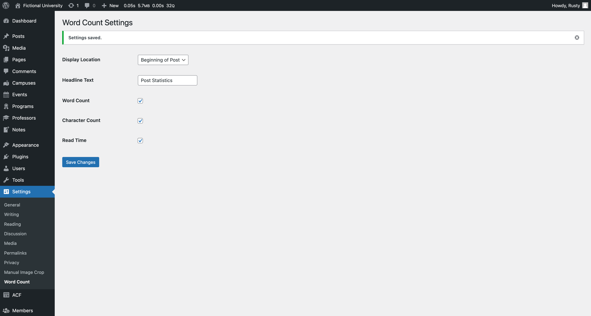

# Word Counter Plugin

[](https://wordpress.org/)
[](https://www.php.net/)
[](https://developer.wordpress.org/plugins/)
[](https://github.com/jarutosurano/wpplugin-word-counter/blob/main/languages)

**Word Counter** is a custom WordPress plugin designed to add a flexible and user-friendly word count functionality to your posts. This plugin enables users to see key post statistics such as word count, estimated reading time, and more.

 

## 🚀 Features

- **Word Count Display:** Displays the total word count for posts.
- **Reading Time Estimate:** Calculates and displays an approximate reading time.
- **Customizable Placement:** Choose where to display the word count (e.g., beginning or end of the post).
- **Admin Settings Page:** Fully customizable options via the WordPress admin panel.

### ✨ Admin Options

- **Word Count Location:** Select whether to display the word count at the start or end of a post.
- **Reading Time Calculation:** Adjust settings like average words per minute.
- **Post Visibility:** Toggle word count visibility for specific post types.

## 🛠️ Technologies Used

- **WordPress API**
- **PHP 8.1+**
- **JavaScript (ES6+)** (for future interactivity)
- **HTML & CSS** for user interface elements
- **Spanish Translation** (via `.pot` file for localization)
- **GitHub Actions** for continuous integration (CI)

## 🔧 Installation

1. Clone or download this repository:
    ```bash
    git clone https://github.com/jarutosurano/wpplugin-word-counter.git
    ```
2. Place the plugin folder inside the WordPress `wp-content/plugins` directory.
3. Activate the plugin in the WordPress admin panel under `Plugins > Installed Plugins`.

## 🧩 How to Use

1. Navigate to `Settings > Word Counter` in the WordPress admin dashboard.
2. Configure the plugin options:
   - Choose where the word count appears.
   - Enable or disable the reading time display.
   - Customize the settings to suit your preferences.

3. Save the settings, and the word count will be displayed automatically based on your configuration.

## 📖 License

This plugin is licensed under the MIT License. See the [LICENSE](LICENSE) file for more details.

## 💬 Feedback

Feedback, bug reports, and feature suggestions are welcome!  
📧 Email me at [jarutosurano@gmail.com](mailto:jarutosurano@gmail.com) or open an [issue](https://github.com/jarutosurano/wpplugin-word-counter/issues).

---

*Let's enhance WordPress functionality, one plugin at a time!*
